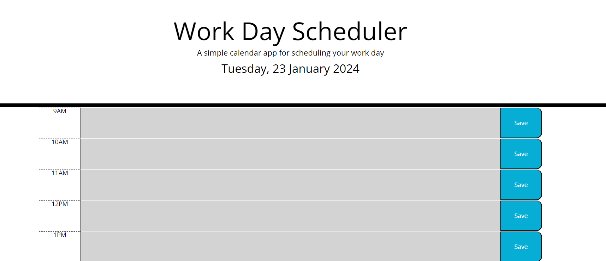

# Daily Planner App

## Description

My 7th challenge for my bootcamp. I was tasked to create a daily planner with standard working hours that allows the user to input and save tasks. It colour codes according to the current hour on the user's device and keeps the tasks on refresh. I was able to complete this task by using a mix of what I was taught in my classes, research, tutoring and office hours provided by the bootcamp. I also conversed with fellow peers regarding the assignment.

## Screenshot

## Live

Link: https://rajpreetkr.github.io/daily-planner-app

## Credits

I used the following to help me get my final code:
https://www.arclab.com/en/kb/htmlcss/display-date-time-javascript-php-ssi.html
https://www.freecodecamp.org/news/how-to-format-dates-in-javascript/
https://www.w3schools.com/tags/tag_textarea.asp
Tutor

## Lisence

MIT Lisence
